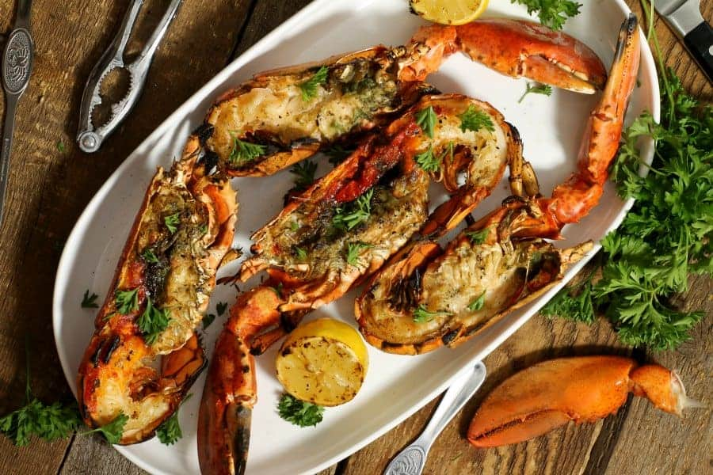
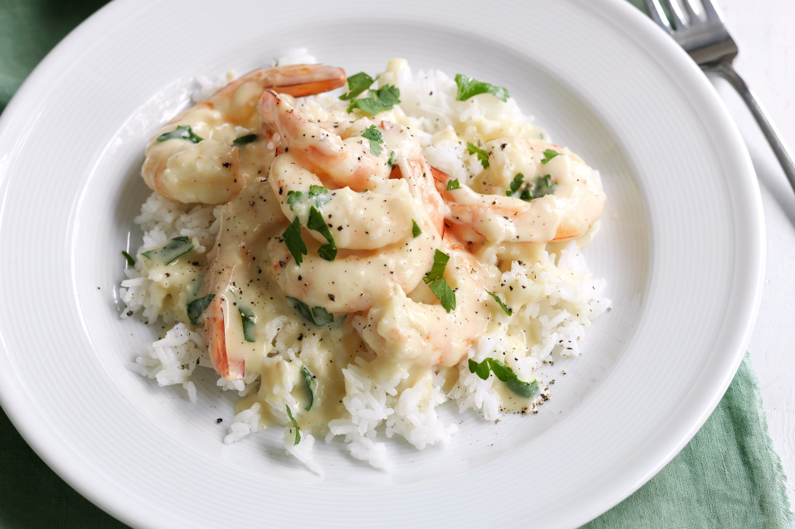
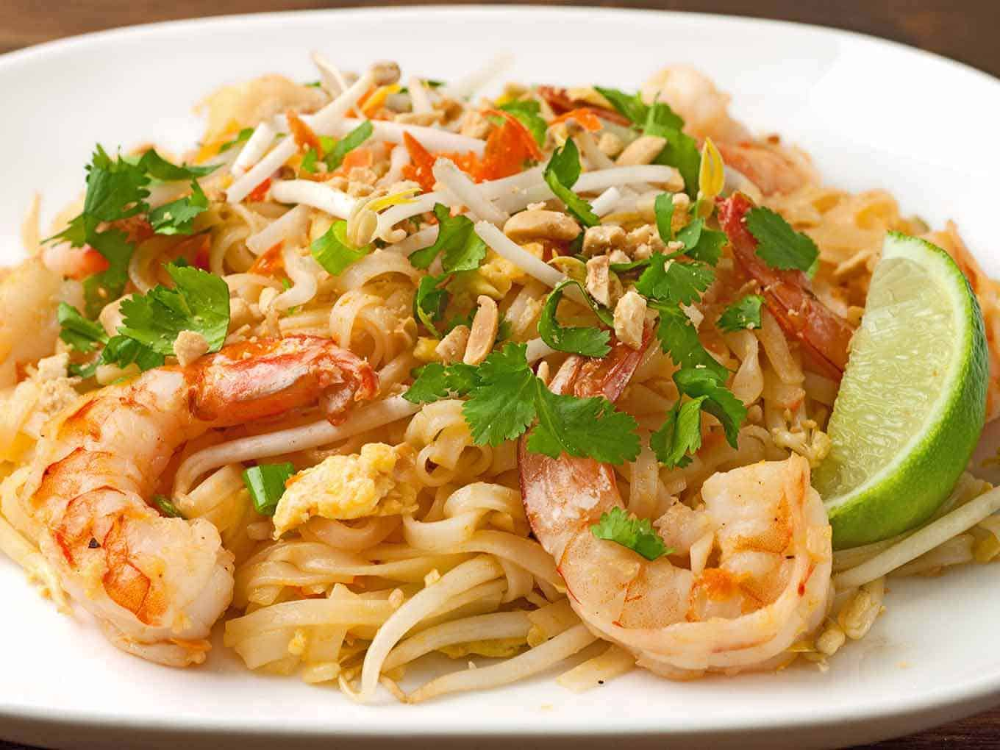
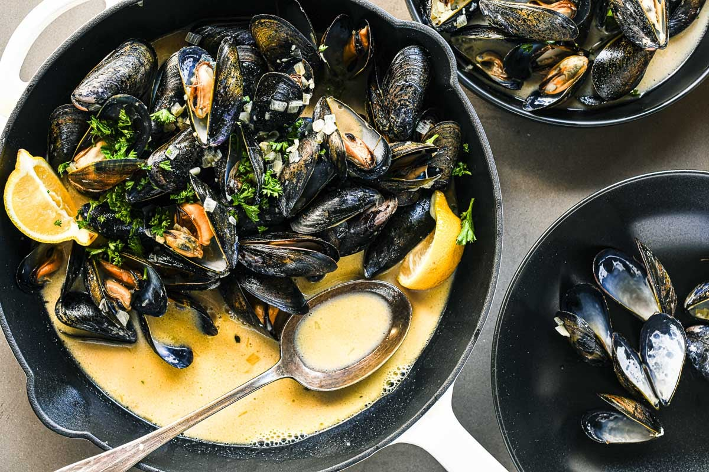
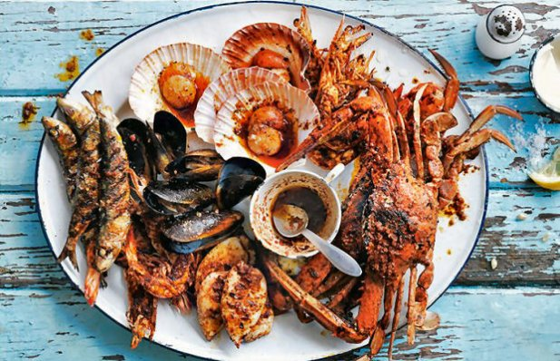
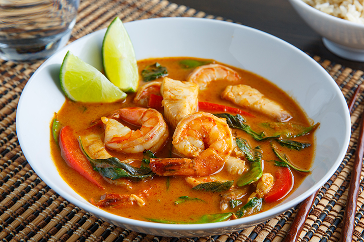

## Menu
[Seafood](#seafood) | [Japanese Food](#japanese-food) | [Indian Food](#Indian-food) |

# Thai-Food

| **Seafood Dish**      | **Description**                               | **Image**                                           | **Price (Thai Baht)** |
|:----------------------|-----------------------------------------------|:---------------------------------------------------:|-----------------------:|
| Grilled Lobster       | Succulent lobster grilled to perfection      |        | 850                   |
| Creamy Garlic Shrimp  | Plump shrimp cooked in a creamy garlic sauce |  | 380                   |
| Spicy Seafood Tom Yum | A classic Thai soup with a mix of seafood and spices |  | 250                   |
| Seafood Pad Thai      | Stir-fried noodles with assorted seafood     |              | 220                   |
| Crispy Calamari       | Lightly battered and fried calamari rings    |               | 180                   |
| Steamed Mussels       | Fresh mussels steamed with aromatic herbs   |        | 210                   |
| Grilled Fish Platter  | Assorted grilled fish served with dipping sauces |   | 420                   |
| Seafood Curry         | Rich and aromatic curry with a medley of seafood |         | 320                   |

# Indian-Food