## Menu

[Mexican Food](#mexican-food) | [Indian Food](#indian-food) | [Japanese Food](#japanese-food) | [Thai Food](#thai-food) | [Korean Food](#korean-food)

---

## Thai Food

| **Thai Dish**      | **Description**                               | **Image**                                           | **Price (THB)** |
|:----------------------|-----------------------------------------------|:---------------------------------------------------:|-----------------------:|
| Green Curry       | Creamy curry with chicken, Thai eggplant, and basil      |        | 320.00                   |
| Som Tum  | Spicy papaya salad with chili, lime, and peanuts | 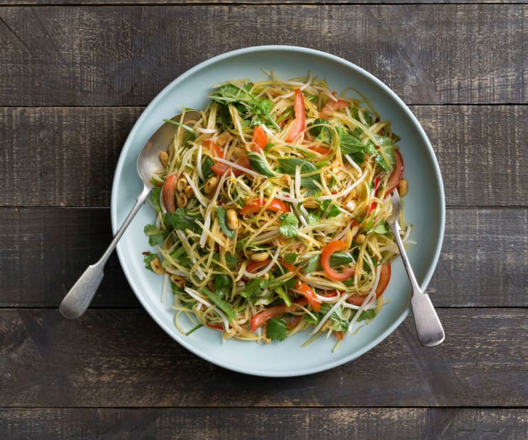 | 180.00                   |
| Spicy Seafood Tom Yum | A classic Thai soup with a mix of seafood and spices | 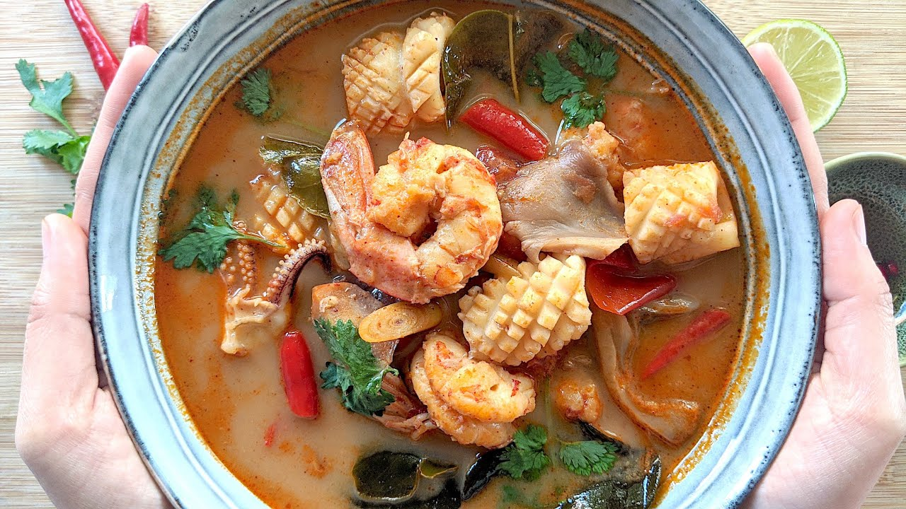 | 250.00                   |
| Seafood Pad Thai      | Stir-fried noodles with assorted seafood     | 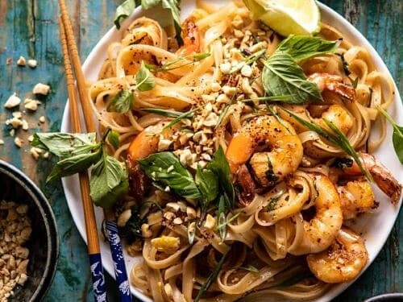             | 220.00                   |
| Khao Pad       | Thai-style fried rice with choice of meat| 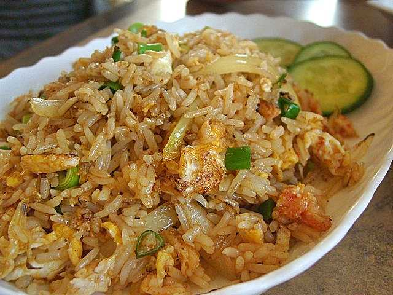                 | 150.00                   |

## Mexican Food

| Dish                              | Description                                   | Image                                                   | Price (THB) |
|:----------------------------------|-----------------------------------------------|---------------------------------------------------------|-----------:|
| Tacos al Pastor                    | Marinated pork tacos with pineapple          | 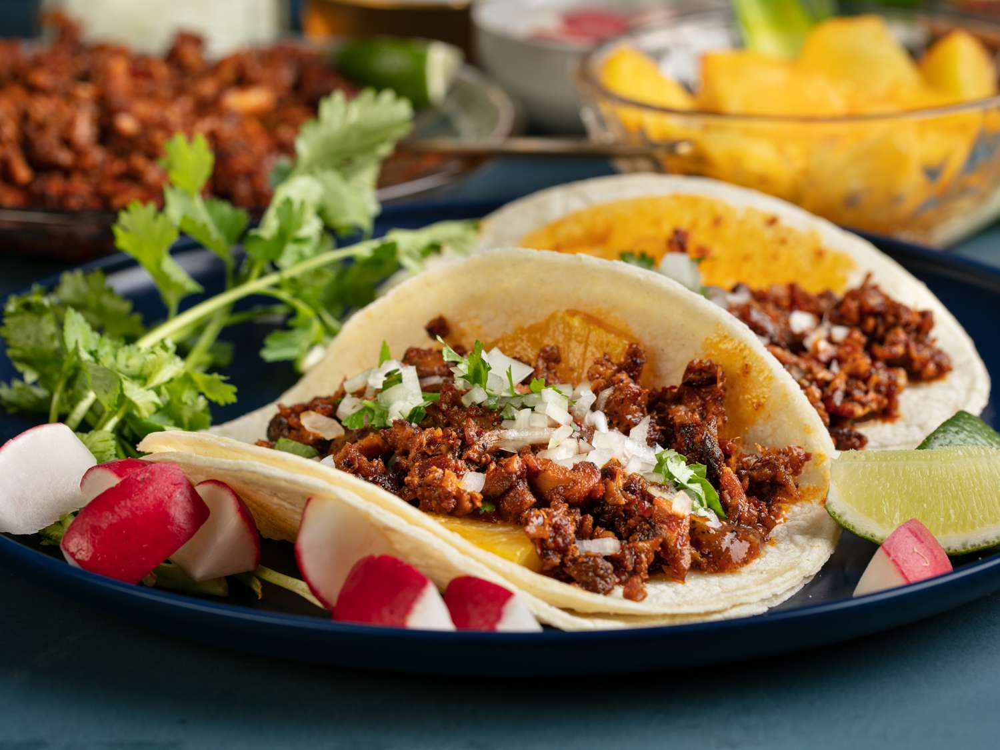    | 75.00      |
| Guacamole                          | Creamy avocado dip with chips                 |         | 180.00     |
| Enchiladas                         | Tortillas filled with meat, cheese, or beans  | 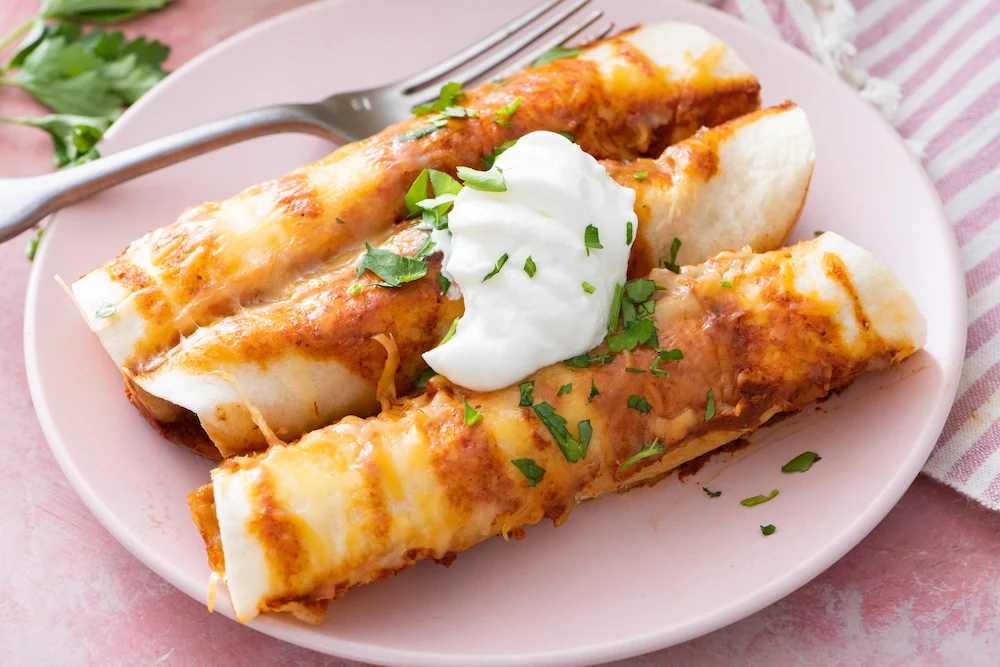      | 255.00     |
| Quesadillas                        | Grilled tortillas stuffed with cheese         | 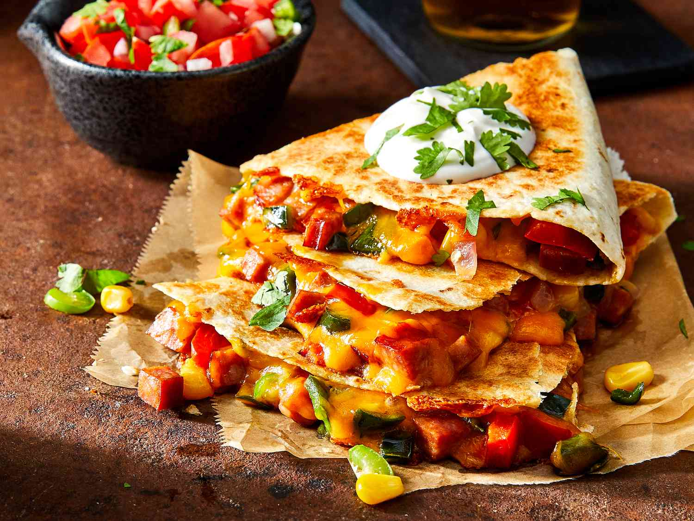    | 135.00     |
| Chiles Rellenos                    | Poblano peppers stuffed with cheese or meat  | 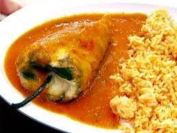 | 280.00     |
| Tamales                            | Steamed masa pockets filled with various fillings |         | 112.00     |
| Carnitas                           | Slow-cooked, tender pork                      |        | 315.00     |
| Sopes                              | Thick tortillas topped with beans, cheese, and salsa | 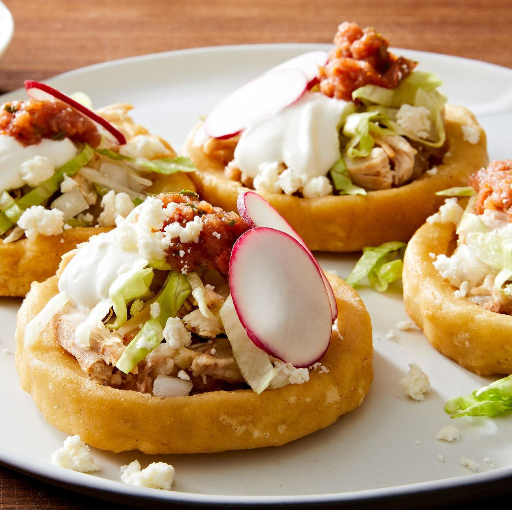          | 157.00     |
| Ceviche                            | Fresh seafood marinated in lime juice         |         | 330.00     |
| Molcajete                          | Hearty stew with grilled meat and veggies     | 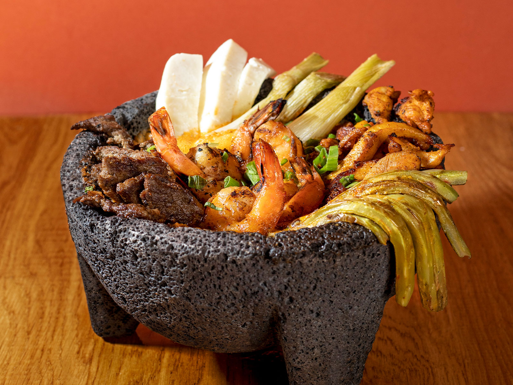    | 465.00     |

# Indian food

| **Indian Dish**         | **Description**                               | **Image**                                           | **Price (THB)** |
|:----------------------|-----------------------------------------------|:---------------------------------------------------:|-----------------------:|
| Butter Chicken       | Tender chicken in rich tomato and butter gravy | 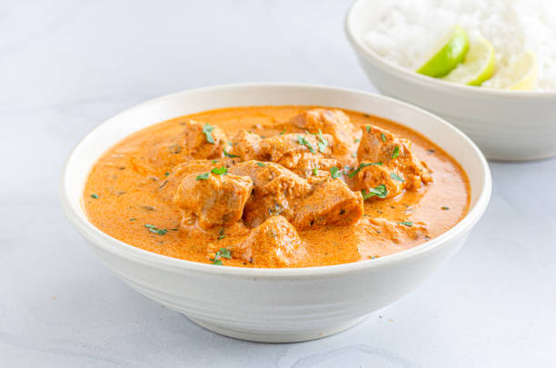       | 320.00                  |
| Vegetable Biryani    | Aromatic rice with mixed vegetables and spices |  | 250.00                   |
| Masala Dosa          | Crispy crepe with spiced potato filling       |              | 180.00                |
| Paneer Tikka         | Grilled paneer cubes marinated in spices      |           | 280.00                   |
| Mango Lassi          | Refreshing yogurt drink with ripe mango       | 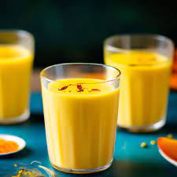            | 90.00                   |

## Korean Food

| Description   |                                  Image                                   |    Price (THB) |
|:--------------|:------------------------------------------------------------------------:|---------:|
| Bibimbap      |      | 150.00 |
| Kimchi Jjigae | 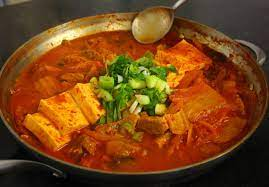 | 120.00 |
| Bulgogi       |       | 180.00 |
| Japchae       |   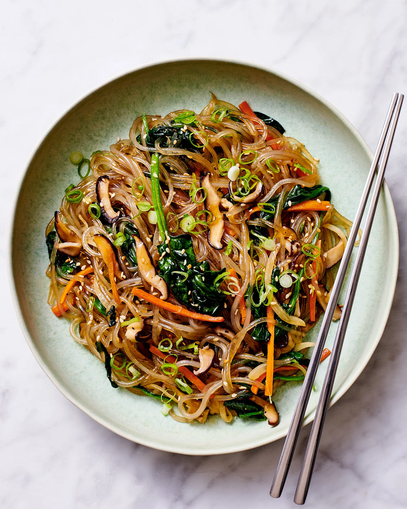    | 130.00 |
| Tteokbokki    |    | 100.00 |

## Japanese Food

| Description      |                                                                               | Price (THB) |
|:-----------------|-------------------------------------------------------------------------------|------------:|
| Sushi Platter    |     |      139.00 |
| Ramen            | 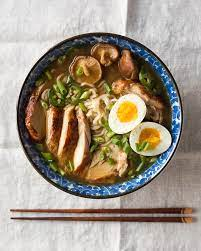           |       99.00 |
| Tempura Set      | 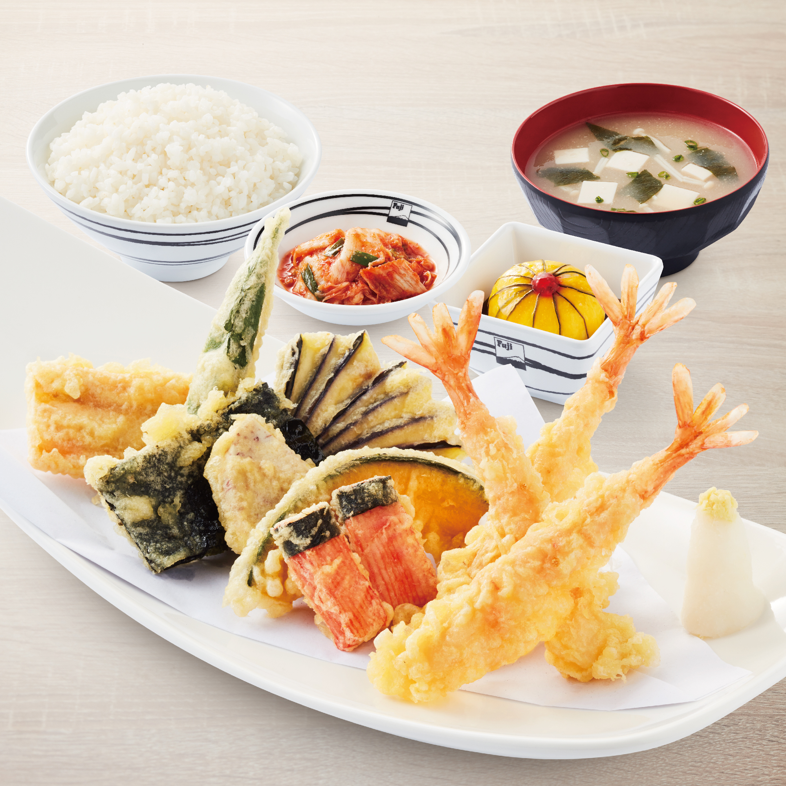      |      149.00 |
| Chicken Teriyaki |  |       79.00 |
| Udon             | 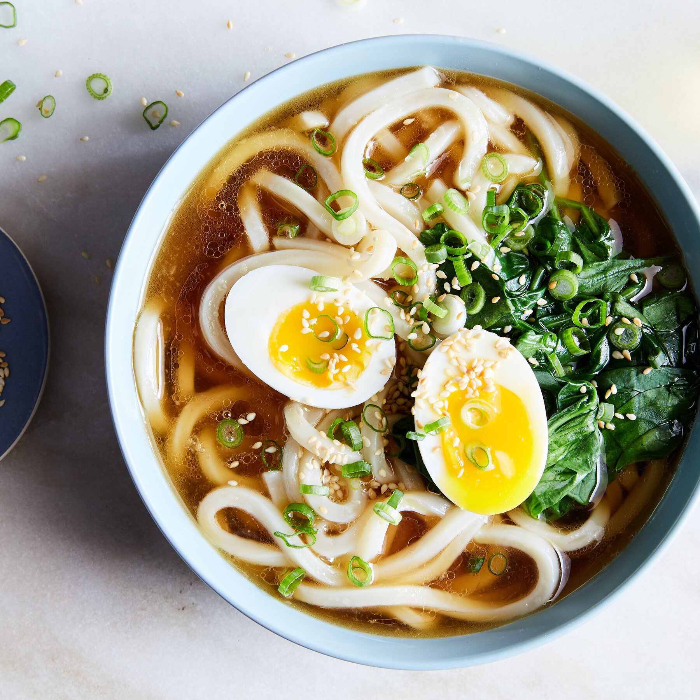            |       99.00 |

